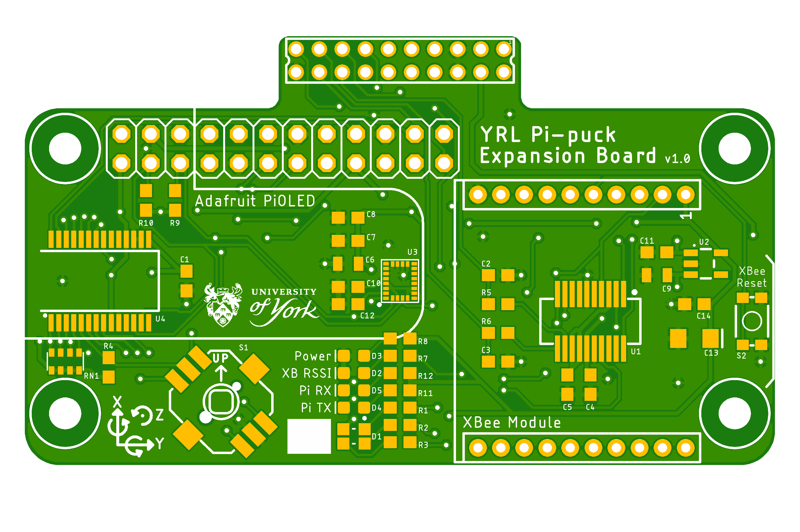

# YRL Expansion Board for the Pi-puck

**An expansion board for the Pi-puck robot platform, including an IMU, XBee socket, navigation switch, RGB LED, and 24-pin Raspberry Pi compatible header.**

See https://github.com/yorkrobotlab/pi-puck for more information on the Pi-puck.

## PCB Layout

## XBee

Scripts to set up the XBee hardware and update the firmware are in [xbee/](xbee/).
Requires the Digi XBee Python Library (see https://github.com/digidotcom/xbee-python).

## Licence

Hardware designs are licensed under a [Creative Commons Attribution-ShareAlike 4.0 International Licence][cc-by-sa].

Unless otherwise specified, software is licensed under an [MIT Licence][mit].

[cc-by-sa]: http://creativecommons.org/licenses/by-sa/4.0/
[mit]: /LICENSE-MIT
